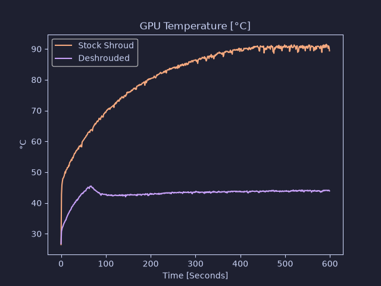

# GPU-Z grapher
Tool for graphing GPU-Z log files.

Generates graphs for the following metrics:
- GPU Clock [MHz]
- Board Power Draw [W]
- Power Consumption (%) [% TDP]
- GPU Temperature [°C]
- Hot Spot [°C]

Example:



## Usage
```
usage: grapher.py [-h] [--idle-clock IDLE_CLOCK] [--time TIME] [--output OUTPUT] [--label LABEL]
                  files [files ...]

positional arguments:
  files                 Filename(s) of GPU-Z log files

options:
  -h, --help            show this help message and exit
  --idle-clock IDLE_CLOCK
                        Trim start of graph to first row with clock speed above this value [MHz]
  --time TIME           How many seconds of data to include in the graph
  --output, -o OUTPUT   Prefix of output files
  --label LABEL         Legend label for each input file, (repeated for each file in order)
  ```

## Example
```
python3 grapher.py --idle-clock 150 --time 600 \
  benchmark1.txt benchmark2.txt \
  --label "Stock Shroud" \
  --label "Deshrouded"
```
